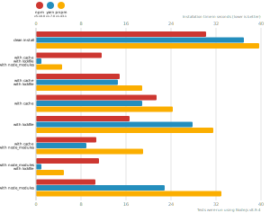
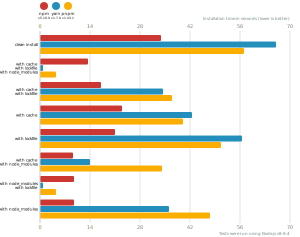
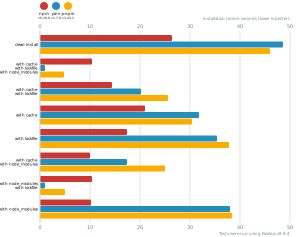
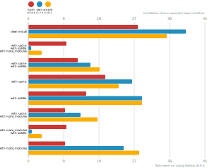
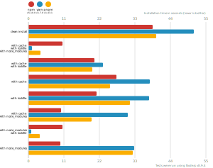

# Node package manager benchmark

This benchmark compares the performance of [npm](https://github.com/npm/npm), [pnpm](https://github.com/pnpm/pnpm) and [yarn](https://github.com/yarnpkg/yarn).

## React app

The app's `package.json` [here](./fixtures/react-app/package.json)

| action  | cache | lockfile | node_modules| npm | Yarn | pnpm |
| ---     | ---   | ---      | ---         | --- | --- | --- |
| install |       |          |             | 30.2s | 36.9s | 39.7s |
| install | ✔    | ✔        | ✔           | 11.7s | 1s | 4.7s |
| install | ✔    | ✔        |             | 14.8s | 14.6s | 18.8s |
| install | ✔    |          |             | 21.4s | 18.9s | 24.3s |
| install |      | ✔        |             | 16.7s | 27.9s | 31.5s |
| install | ✔    |          | ✔           | 10.7s | 8.9s | 19.1s |
| install |      | ✔        | ✔           | 11.2s | 958ms | 4.9s |
| install |      |          | ✔           | 10.6s | 22.9s | 33s |

## Ember app

The app's `package.json` [here](./fixtures/ember-quickstart/package.json)

| action  | cache | lockfile | node_modules| npm | Yarn | pnpm |
| ---     | ---   | ---      | ---         | --- | --- | --- |
| install |       |          |             | 33.9s | 1m 6s | 57.1s |
| install | ✔    | ✔        | ✔           | 13.3s | 933ms | 4.5s |
| install | ✔    | ✔        |             | 17.2s | 34.4s | 36.9s |
| install | ✔    |          |             | 22.9s | 42.6s | 40s |
| install |      | ✔        |             | 21.1s | 56.5s | 50.7s |
| install | ✔    |          | ✔           | 9.3s | 14.1s | 34.2s |
| install |      | ✔        | ✔           | 9.6s | 893ms | 4.5s |
| install |      |          | ✔           | 9.5s | 36s | 47.7s |

## Angular app

The app's `package.json` [here](./fixtures/angular-quickstart/package.json)

| action  | cache | lockfile | node_modules| npm | Yarn | pnpm |
| ---     | ---   | ---      | ---         | --- | --- | --- |
| install |       |          |             | 26.4s | 48.5s | 45.9s |
| install | ✔    | ✔        | ✔           | 10.4s | 918ms | 4.8s |
| install | ✔    | ✔        |             | 14.3s | 20.2s | 25.5s |
| install | ✔    |          |             | 21s | 31.8s | 30.3s |
| install |      | ✔        |             | 17.3s | 35.4s | 37.7s |
| install | ✔    |          | ✔           | 9.9s | 17.4s | 25s |
| install |      | ✔        | ✔           | 10.3s | 887ms | 4.9s |
| install |      |          | ✔           | 10.1s | 37.9s | 38.3s |

## Medium Size App

The app's `package.json` [here](./fixtures/medium-size-app/package.json)

| action  | cache | lockfile | node_modules| npm | Yarn | pnpm |
| ---     | ---   | ---      | ---         | --- | --- | --- |
| install |       |          |             | 27.9s | 40.2s | 35.3s |
| install | ✔    | ✔        | ✔           | 9.8s | 834ms | 3.5s |
| install | ✔    | ✔        |             | 12.6s | 15.8s | 18.1s |
| install | ✔    |          |             | 19.6s | 26.4s | 23s |
| install |      | ✔        |             | 14.8s | 28.9s | 29s |
| install | ✔    |          | ✔           | 9.3s | 13.3s | 17.7s |
| install |      | ✔        | ✔           | 9.7s | 910ms | 3.5s |
| install |      |          | ✔           | 9.3s | 24.3s | 28.3s |

## Lots of Files

The app's `package.json` [here](./fixtures/alotta-files/package.json)

| action  | cache | lockfile | node_modules| npm | Yarn | pnpm |
| ---     | ---   | ---      | ---         | --- | --- | --- |
| install |       |          |             | 38.6s | 51.3s | 39.6s |
| install | ✔    | ✔        | ✔           | 10.6s | 1s | 3.7s |
| install | ✔    | ✔        |             | 20.4s | 23s | 19.7s |
| install | ✔    |          |             | 27.3s | 37.7s | 25.4s |
| install |      | ✔        |             | 21.2s | 37.5s | 31.5s |
| install | ✔    |          | ✔           | 10.2s | 30.8s | 19.6s |
| install |      | ✔        | ✔           | 10.5s | 918ms | 3.5s |
| install |      |          | ✔           | 10s | 32.7s | 32.4s |

