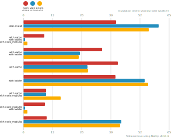
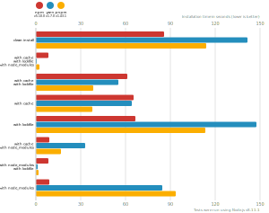
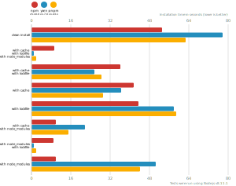
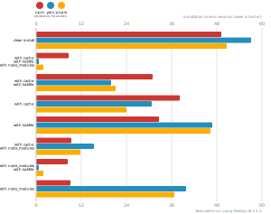
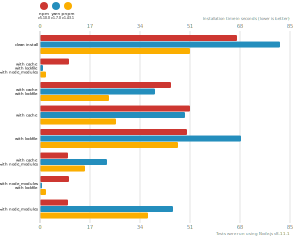

# Node package manager benchmark

This benchmark compares the performance of [npm](https://github.com/npm/npm), [pnpm](https://github.com/pnpm/pnpm) and [yarn](https://github.com/yarnpkg/yarn).

## React app

The app's `package.json` [here](./fixtures/react-app/package.json)

| action  | cache | lockfile | node_modules| npm | Yarn | pnpm |
| ---     | ---   | ---      | ---         | --- | --- | --- |
| install |       |          |             | 41.4s | 1m 0.3s | 55.8s |
| install | ✔    | ✔        | ✔           | 9.4s | 893ms | 1.7s |
| install | ✔    | ✔        |             | 35s | 25.1s | 24.7s |
| install | ✔    |          |             | 42.1s | 28.5s | 28.8s |
| install |      | ✔        |             | 41s | 54.1s | 55.7s |
| install | ✔    |          | ✔           | 10.2s | 10.2s | 16.6s |
| install |      | ✔        | ✔           | 9.5s | 837ms | 1.7s |
| install |      |          | ✔           | 10.5s | 43.8s | 43.1s |

## Ember app

The app's `package.json` [here](./fixtures/ember-quickstart/package.json)

| action  | cache | lockfile | node_modules| npm | Yarn | pnpm |
| ---     | ---   | ---      | ---         | --- | --- | --- |
| install |       |          |             | 1m 25.7s | 2m 21.3s | 1m 54s |
| install | ✔    | ✔        | ✔           | 8.1s | 804ms | 2.5s |
| install | ✔    | ✔        |             | 1m 1.4s | 55.4s | 38.3s |
| install | ✔    |          |             | 1m 5.5s | 1m 4s | 38s |
| install |      | ✔        |             | 1m 6.5s | 2m 27.4s | 1m 53.4s |
| install | ✔    |          | ✔           | 8.7s | 33.2s | 16.5s |
| install |      | ✔        | ✔           | 8.3s | 856ms | 1.8s |
| install |      |          | ✔           | 8.9s | 1m 24.7s | 1m 33.7s |

## Angular app

The app's `package.json` [here](./fixtures/angular-quickstart/package.json)

| action  | cache | lockfile | node_modules| npm | Yarn | pnpm |
| ---     | ---   | ---      | ---         | --- | --- | --- |
| install |       |          |             | 53.1s | 1m 17.8s | 1m 2.6s |
| install | ✔    | ✔        | ✔           | 9.2s | 858ms | 1.9s |
| install | ✔    | ✔        |             | 36.3s | 25.6s | 28.5s |
| install | ✔    |          |             | 41.7s | 36.5s | 29.1s |
| install |      | ✔        |             | 43.5s | 58s | 58.8s |
| install | ✔    |          | ✔           | 10s | 21.7s | 15s |
| install |      | ✔        | ✔           | 9.1s | 909ms | 1.8s |
| install |      |          | ✔           | 9.9s | 50.5s | 44.2s |

## Medium Size App

The app's `package.json` [here](./fixtures/medium-size-app/package.json)

| action  | cache | lockfile | node_modules| npm | Yarn | pnpm |
| ---     | ---   | ---      | ---         | --- | --- | --- |
| install |       |          |             | 49.3s | 57.2s | 50.7s |
| install | ✔    | ✔        | ✔           | 8.6s | 796ms | 1.9s |
| install | ✔    | ✔        |             | 31s | 19.8s | 21.2s |
| install | ✔    |          |             | 38.2s | 30.8s | 24s |
| install |      | ✔        |             | 32.7s | 46.8s | 46.3s |
| install | ✔    |          | ✔           | 9.3s | 15.3s | 11.7s |
| install |      | ✔        | ✔           | 8.4s | 794ms | 1.8s |
| install |      |          | ✔           | 9s | 39.9s | 36.6s |

## Lots of Files

The app's `package.json` [here](./fixtures/alotta-files/package.json)

| action  | cache | lockfile | node_modules| npm | Yarn | pnpm |
| ---     | ---   | ---      | ---         | --- | --- | --- |
| install |       |          |             | 1m 7.1s | 1m 21.6s | 50.9s |
| install | ✔    | ✔        | ✔           | 9.9s | 934ms | 2s |
| install | ✔    | ✔        |             | 44.4s | 39.1s | 23.6s |
| install | ✔    |          |             | 51.1s | 49.4s | 25.9s |
| install |      | ✔        |             | 49.9s | 1m 8.3s | 47s |
| install | ✔    |          | ✔           | 9.6s | 22.8s | 15.3s |
| install |      | ✔        | ✔           | 9.7s | 791ms | 2s |
| install |      |          | ✔           | 9.5s | 45.2s | 36.7s |

